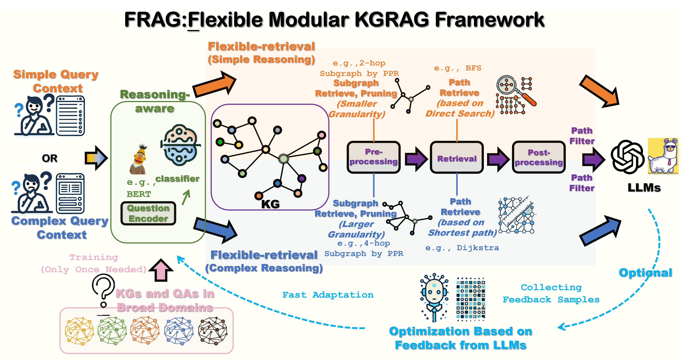

# FRAG pipeline

The codes are associated with the following paper:

>**FRAG: A Flexible Modular Framework for Retrieval-Augmented Generation based on Knowledge Graphs** [[PDF](https://arxiv.org/abs/2501.09957)]  
> Zengyi Gao, Yukun Cao, Hairu Wang, Ao Ke, Yuan Feng, Xike Xie, S Kevin Zhou     
> Annual Meeting of the Association for Computational Linguistics (ACL), 2025.

<p align="center">

</p>

## Step 0: Data preprocessing
Get `test_name.jsonl` using PPR algorithm.

Refer to [data preprocessing](data_preprocess/README.md) for details.

## Step 1: Get reasoning paths
```python
python getPaths.py
```
This script will generate reasoning paths for each query. The paths are generated using`RecordPipeline(PreRetrievalModuleBGE(64), RetrievalModuleBFS(2), PostRetrievalModuleBGE(32))` for simple query, `RecordPipeline(PreRetrievalModuleBGE(64), RetrievalModuleDij(4), PostRetrievalModuleBGE(32))` for complex query.

## Step 2: Reasoning using paths and LLM
```python
python Reason.py
```

## Step 3: FRAG
Download the Reasoning-aware model from [here](https://huggingface.co/gzy02/ReasoningAwareModule), and run
```python
python FRAG.py
```

## Step 4: FRAG_F
set `stop_tokens = ["\n"]`, and run
```python
python getHopPred.py
```

After getting the hop prediction for FRAG-Simple and FRAG-Complex, run
```python
python FRAG_F.py
```
for final FRAG_F prediction.

**Cite our paper:**
If you find this work is helpful to your research, please consider citing our paper:
```bibtex
@inproceedings{gao-FRAG-2025,
    title = "FRAG: A Flexible Modular Framework for Retrieval-Augmented Generation based on Knowledge Graphs",
    author = "Zengyi Gao, Yukun Cao, Hairu Wang, Ao Ke, Yuan Feng, Xike Xie, S Kevin Zhou",
    booktitle = "Findings of the Association for Computational Linguistics: ACL 2025",
    year = "2025",
    publisher = "Association for Computational Linguistics"
}
```
